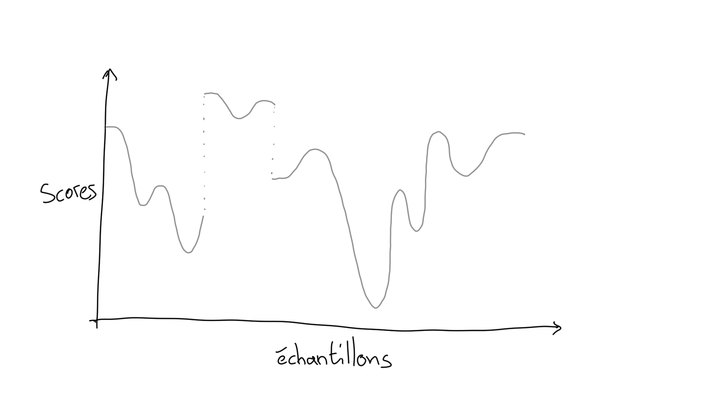
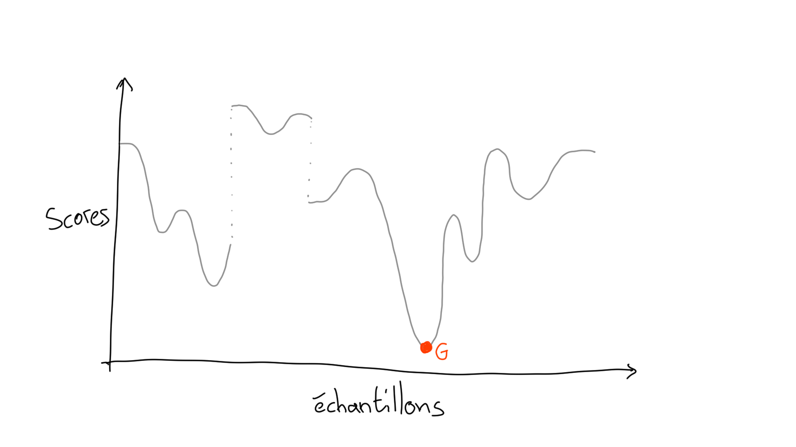
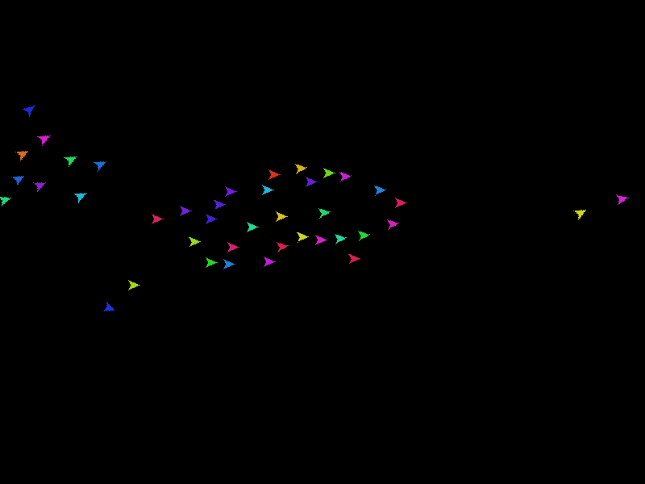
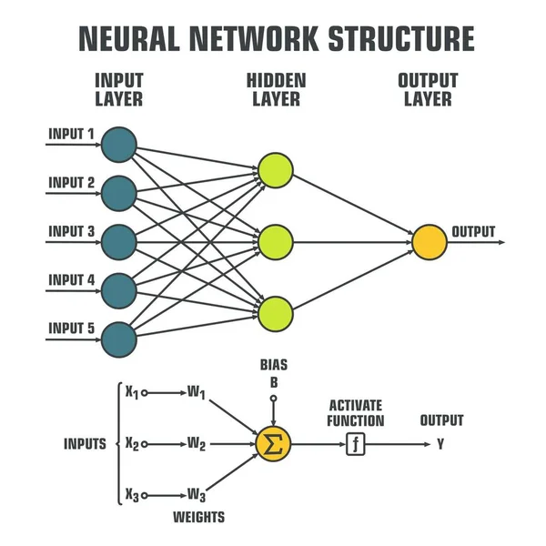
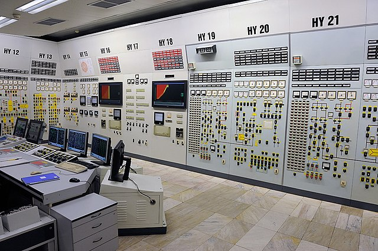
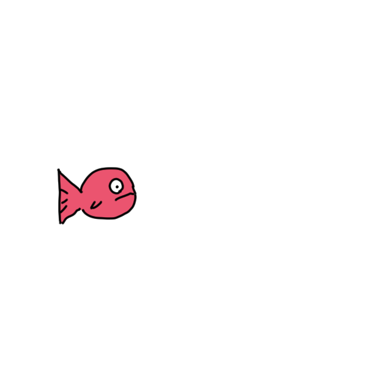
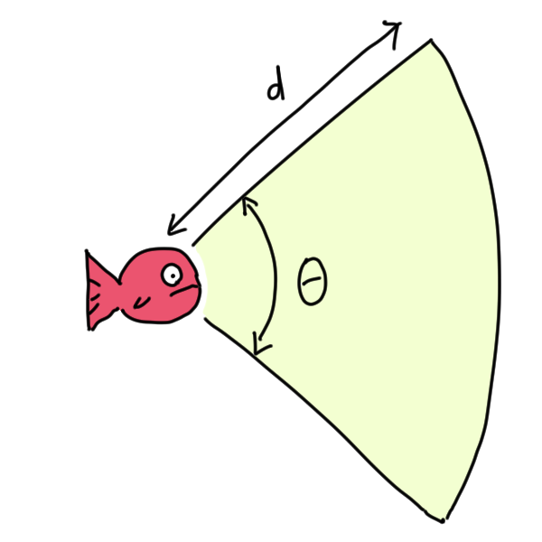
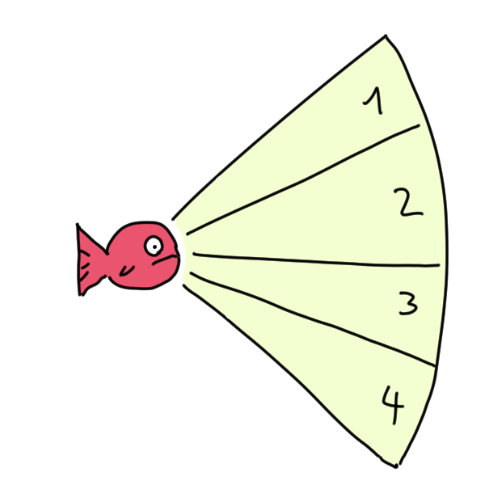

# **Découverte d'une méthode d'optimisation**

**Particle Swarm Optimization (PSO)**

---

# L'optimisation

Qu'est-ce que c'est ?

---

## L'optimisation et les cookies

<!-- donner des exemples "bateaux" -->
<!-- - recherche après une avalanche -->
<!-- - une recette de cookies -->

<!-- but de l'optimisation : trouver le minimum (le plus efficacement possible) -->

<!-- Vertex AI Vizier is a black-box optimization service that helps you tune hyperparameters in complex machine learning (ML) models. -->

---

## L'optimisation et les cookies

Un évaluateur pour scorer

---

---

---

# Boids

---

Boids Simulation
[Nilorasu/PyNBoids](https://github.com/Nikorasu/PyNBoids)

---

# Boids

1. Cohésion
2. Séparation
3. Alignement

---

# Boids

https://eater.net/boids

<!-- voir Fouloscopie, les effets spéciaux de foule au cinéma : https://youtu.be/w-Oy4TYDnoQ -->

---

# PSO

**P**article **S**warm **O**ptimization

Optimisation par essaim de particules

---

# PSO

#### Vitesse d'une particule
$$V_{k+1} = {\omega}V_k+b_1(P_i-X_k)+b_2(P_g-X_k)$$

#### Position d'une particule :
$$X_{k+1} = X_k + V_{k+1}$$

---

# Optimisation d'un problème "jouet"

Essai de PSO avec des équations connues.

<!-- test functions: https://en.wikipedia.org/wiki/Test_functions_for_optimization -->

---

# Limites

<!-- sortie des particules de l'espace de recherche -->

<!-- problème dans les espaces à grandes dimensions (> 100) -->

<!-- curse of dimensionality (malédiction de la dimension) -->

<!-- -> l'analyse dans un grand espace dépend grandement du nombre d'échantillons -->

---

# Réseau de neurones

<!-- décrire simplement le fonctionnement d'un perceptron multicouche -->
<!-- comment on optimise ça ??? -->
<!-- exemple du tableau de bord avec plein de potars -->

---

# Réseau de neurones

---

# MNIST

---

# Neurofish

---

# Neurofish

---

# Neurofish

---

# Gym

<!-- lib pour faire du reinforcement learning (avec des projets-jouets déjà existants) -->

<!-- PSO + Gym -->

---

# Questions ?
